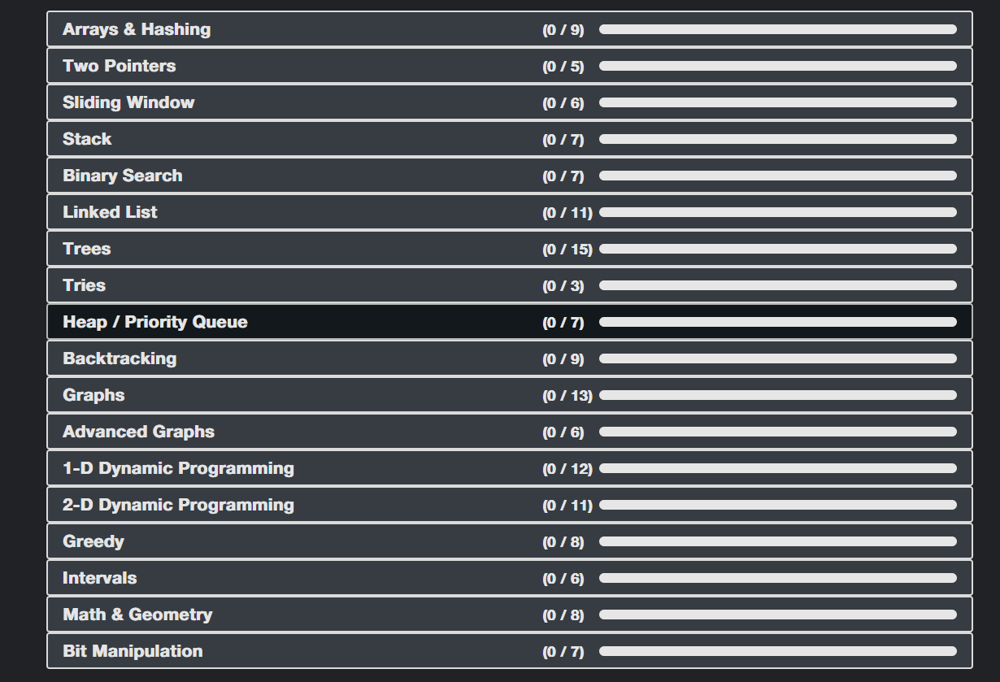

# DSA-playground
play with Data structures and Algorithms

# typescript setup
```ts
npm install -g ts-node typescript '@types/node'

tsc --init

ts-node typescript-file.ts
```

# Time complexity
- log n (log <sub><sub>2</sub></sub> n)
  - if we divide any number by 2 then its base 2
  - so it is actually log base 2 of n
    - <b>NOTE:</b> log <sub><sub>2</sub></sub> n = x and 2<sup>x</sup> = n
```
n is 16
16 -> 8 -> 4 -> 2 -> 1
```

# Space Complexity:

## Auxiliary O(N)
The optimized approaches in this article use in-place solutions. Does in-place mean a constant space complexity? By definition, an in-place algorithm transforms the input using no auxiliary data structures proportional to the input size. An in-place algorithm does not necessarily mean constant space complexity; for example, an in-place recursive algorithm uses the recursion stack, so the space is not constant.

# basic list


# advanced DSA
- Kadane's Algorithm
- Sliding Window Fixed Size
- Sliding Window Variable Size
- Two Pointers
- Prefix Sums
- Fast and Slow Pointers
- Trie
- Union-Find
- Segment Tree
- Iterative DFS
- Two Heaps
- Subsets
- Combinations
- Permutations
- Dijkstra's
- Prim's
- Kruskal's
- Topological Sort
- 0 / 1 Knapsack
- Unbounded Knapsack
- LCS
- Palindrome
